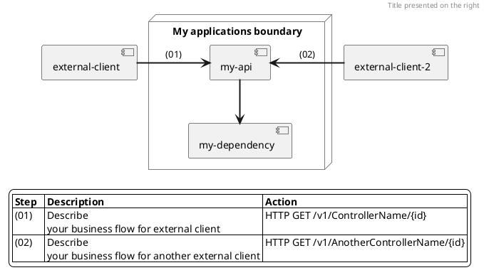

= Using plantuml in AsciiDoc on GitHub
:author: David Buret
:source-highlighter: pygments
:pygments-style: github
:icons: font
:sectnums:
:toclevels: 4
:toc:
:imagesdir: images/
:toc-title: Sommaire
:gitplant: http://www.plantuml.com/plantuml/proxy?src=https://raw.githubusercontent.com/DBuret/journal/master/
ifdef::env-github[]
:tip-caption: :bulb:
:note-caption: :information_source:
:important-caption: :heavy_exclamation_mark:
:caution-caption: :fire:
:warning-caption: :warning:
endif::[]

image::{gitplant}/test.puml[PlantUML Image]

# Business flows

## Diagrams as code

The motivation for choosing to document business flows with [PlantUML](https://plantuml.com) diagrams is because its format:

- provides cross-platform and portable source code that can be viewed and edited on websites or plugins.
- helps to document as code the interactions between applications to be easily reviewed by engineers and versioned with git flow.
- prevents engineers from using mouse-based tools like Confluence or 3rd party tools to design static diagrams that can be hard to find and maintain.
- can help automation teams create tools or scripts around business processes documented as code. For example, scripts could define SLOs for a particular business flow already documented in PlantUML.

## Useful links 🔗
 
### IDE plugins
- [PlantUML extension for Visual Code](https://marketplace.visualstudio.com/items?itemName=jebbs.plantuml)
- [PlantUML for Visual Studio](https://marketplace.visualstudio.com/items?itemName=KieranBorsden.PlantUmlLanguageService)

### Online editors
- [Kkeisuke editor](https://plantuml-editor.kkeisuke.com/)
- [Plant text editor](https://www.planttext.com)

### Code syntax
- [Component diagram](https://plantuml.com/component-diagram)

### Formatting
- [Colors](https://plantuml.com/color)
- [Cloudinsight icons](https://github.com/plantuml-stdlib/cicon-plantuml-sprites)
- [Themes](https://plantuml.com/theme)
- [Crashed mind examples](https://crashedmind.github.io/PlantUMLHitchhikersGuide)

## Examples
- [Real world Plant UML](https://real-world-plantuml.com)

## Template

