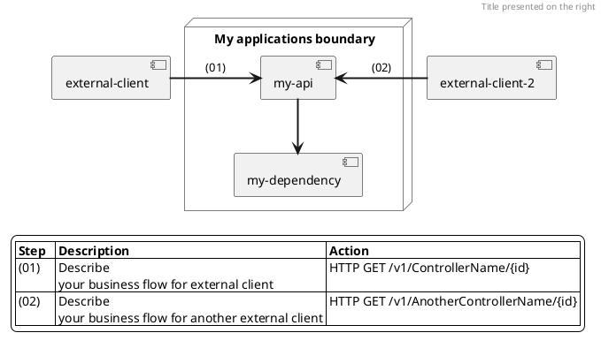

# Business flows


## Diagrams as code

The motivation for choosing to document business flows with [PlantUML](https://plantuml.com) diagrams is because its format:

- provides cross-platform and portable source code that can be viewed and edited on websites or plugins.
- helps to document as code the interactions between applications to be easily reviewed by engineers and versioned with git flow.
- prevents engineers from using mouse-based tools like Confluence or 3rd party tools to design static diagrams that can be hard to find and maintain.
- can help automation teams create tools or scripts around business processes documented as code. For example, scripts could define SLOs for a particular business flow already documented in PlantUML.

## Render Plant UML in GitLab or GitHub

Pretty straigthforward for public domains.
```md

```
If you cannot expose puml to an external/public proxy, you can use your own plantuml server to proxy puml files for rendering diagrams.

## Useful links 🔗
 
### IDE plugins
- [PlantUML extension for Visual Code](https://marketplace.visualstudio.com/items?itemName=jebbs.plantuml)
- [PlantUML for Visual Studio](https://marketplace.visualstudio.com/items?itemName=KieranBorsden.PlantUmlLanguageService)

### Online editors
- [Kkeisuke editor](https://plantuml-editor.kkeisuke.com/)
- [Plant text editor](https://www.planttext.com)

### Code syntax
- [Component diagram](https://plantuml.com/component-diagram)

### Formatting
- [Colors](https://plantuml.com/color)
- [Cloudinsight icons](https://github.com/plantuml-stdlib/cicon-plantuml-sprites)
- [Themes](https://plantuml.com/theme)
- [Crashed mind examples](https://crashedmind.github.io/PlantUMLHitchhikersGuide)

## Examples
- [Real world Plant UML](https://real-world-plantuml.com)

## Template




## Export to png

Where you read  it will show up in vscode as ESC[91m. And ESC[m resets the color to default

batch
```bat
REM How to use: .\export.bat help
REM export.bat test.puml .\
set _pass=1

@echo off
echo Copyright (C) Junior Mayhe. All rights reserved.
echo Exports a puml file to png format. Requires Java installed and plantuml.jar.
echo.
goto checkPumlFile

:help
echo Usage:
echo        export.ps1 ^<puml file^> ^<png dir^>
echo.
echo The arguments are:
echo.
echo        ^<puml file^>       the input PlantUML file path and name
echo        ^<png dir^>         the output PNG dir
echo.
echo. Example:
echo        export.bat test.puml .\
echo.
goto :eof

:checkPumlFile
if "%1"=="help" goto :help
if "%1"=="" goto pumlMissing

:checkPngDir
if "%2"=="" goto pngMissing

:run
if %_pass%==0 (
    echo Use "export.bat ^<help^>" for more information about this exporter.
    goto :eof
)

set _pumlFile=%1
set _pngDir=%2
echo Input: %_pumlFile%
echo Output: %_pngDir%

java -jar .\plantuml.jar %_pumlFile% -o %_pngDir% -progress
echo.
echo.
echo Done.

goto :eof

:pumlMissing
echo - Please enter the input PlantUML path and file name
set _pass=0
goto checkPngDir

:pngMissing
echo - Please enter the output PNG dir
echo.
set _pass=0
goto :eof
```

Powershell
```ps
# How to use: powershell .\export.ps1 help
# powershell .\export.ps1 test.puml .\
param (
    [string]$pumlFile,
    [string]$pngDir
)

Write-Host "Copyright (C) Junior Mayhe. All rights reserved."
Write-Host "Exports a puml file to png format. Requires Java installed and plantuml.jar.`n"

if ($pumlFile -eq "help") {
    Write-Host "Usage:`n"
    Write-Host "        export.ps1 <puml file> <png dir>`n" -ForegroundColor Yellow
    Write-Host "The arguments are:`n"
    Write-Host "        <puml file>        the input PlantUML file path and name"
    Write-Host "        <png dir>         the output PNG path`n`n"
    Write-Host "Example:"
    Write-Host "        powershell .\export.ps1 test.puml .\`n"
    exit
}

$isValid = 1
if ($pumlFile -eq $null -or $pumlFile -eq "") {
    Write-Host "- Please enter the input PlantUML path and file name." -ForegroundColor Red   
    $isValid = 0
}

if ($pngDir -eq $null -or $pngDir -eq "") {
    Write-Host "- Please enter the output PNG dir." -ForegroundColor Red   
    $isValid = 0
}

if ($isValid -eq 1) {
    Write-Host "Input: $($pumlFile)"
    Write-Host "Output: $($pngDir)"
    java -jar .\plantuml.jar "$($pumlFile)" -o "$($pngDir)" -progress
    Write-Host "`n`nDone."
}
```

bash
```sh
#!/bin/bash
# How to use: ./export.sh help
# ./export.sh test.puml ./
echo -e "Exports a puml file to png format. Requires Java installed and plantuml.jar.\n"
pumlFile=$1
pngDir=$2

if [[ -n $pumlFile && $pumlFile == "help" ]]; then
    echo -e "Usage:\n"
    echo -e "        export.ps1 <puml file> <png dir>\n"
    echo -e "The arguments are:\n"
    echo "        <puml file>       the input PlantUML file path and name"
    echo -e "        <png dir>         the output PNG path\n"
    echo -e "Example:"
    echo -e "       ./export.sh test.puml .\n"
    exit 0
fi

isValid=1
if [ ! "$pumlFile" ] ; then
    echo - Please enter the input PlantUML path and file name.
    isValid=0
fi

if [ ! "$pngDir" ] ; then
    echo - Please enter the output PNG dir.
    isValid=0
fi

if [ $isValid -eq 1 ] ; then
    echo "Input: $pumlFile"
    echo "Output: $pngDir"
    java -jar ./plantuml.jar "$pumlFile" -o "$pngDir" -progress
    echo -e "\n\nDone".
fi
```
